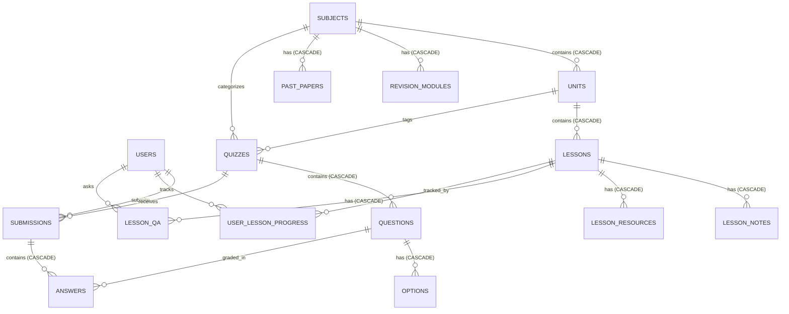

# LearnSteer Backend — Complete Architecture, API & Database Specification

> **Official Backend Documentation**  
> **Repository:** `sasnaka-learnsteer/ss-quiz-platform-backend`  
> **Production API Base URL:** `https://ss-quiz-platform-backend-8f9b2c83591e.herokuapp.com/api/v1`  
> **Frontend Application:** `https://ss-quiz-platform-frontend-nu.vercel.app`  

---

## 📑 Table of Contents
1. [Platform Architecture & Tech Stack](#1-platform-architecture--tech-stack)
2. [Complete REST API Reference](#2-complete-rest-api-reference)
3. [Database Entity Relationship (ER) Diagram](#3-database-entity-relationship-er-diagram)
4. [Complete Database Schema DDL (SQL Script)](#4-complete-database-schema-ddl-sql-script)
5. [Seed Data SQL Script](#5-seed-data-sql-script)
6. [Environment Variables & Deployment Guide](#6-environment-variables--deployment-guide)

---

## 1. Platform Architecture & Tech Stack

LearnSteer is an educational self-learning and diagnostic exam platform designed for Sri Lankan Advanced Level (A/L) students across **5 academic streams** (Bio Science, Physical Science, Commerce, Technology, Arts) and **3 language mediums** (Sinhala, Tamil, English).

```
┌─────────────────────────────────────────────────────────────┐
│             React + TailwindCSS Frontend (Vercel)           │
│      https://ss-quiz-platform-frontend-nu.vercel.app        │
└──────────────────────────────┬──────────────────────────────┘
                               │ HTTPS / JSON REST API
┌──────────────────────────────▼──────────────────────────────┐
│                    Go Gin Router Engine                     │
│                  (Heroku Container / Dyno)                  │
├─────────────────────────────────────────────────────────────┤
│ Middleware: CORS · JWT Auth · B2B API Key · Gzip · Recovery │
├─────────────────────────────────────────────────────────────┤
│ Modules:                                                    │
│  - auth         : Authentication, SSO Tickets & Webhooks    │
│  - dashboard    : Student Dashboard & Smart Revision AI     │
│  - progress     : Z-Scores, Island Rank & Activity Heatmap  │
│  - lesson       : Syllabus, Units, Player, Notes & Q&A      │
│  - examshub     : Exam Breakdown, Badges & Mock Calendars   │
│  - quiz         : Question Engine & Leaderboards            │
│  - submission   : Auto-Grading Engine & Timing Logs         │
├─────────────────────────────────────────────────────────────┤
│ GORM ORM (Object-Relational Mapping & Migrations)           │
└──────────────────────────────┬──────────────────────────────┘
                               │ TCP / SSL
┌──────────────────────────────▼──────────────────────────────┐
│             PostgreSQL Database (Neon Serverless)           │
└─────────────────────────────────────────────────────────────┘
```

- **Runtime & Language:** Go 1.24
- **Web Framework:** [Gin Web Framework](https://github.com/gin-gonic/gin)
- **Database ORM:** [GORM](https://gorm.io/) with PostgreSQL Driver (`pgx`)
- **Database Engine:** PostgreSQL 16 (Neon Serverless with Connection Pooling)
- **Security:** JWT Authentication (`golang-jwt/jwt/v5`), Bcrypt password hashing, SHA256 Single-Use SSO Tickets
- **Design Pattern:** Server-Driven UI (SDUI) — Frontend components dynamically adapt based on declarative JSON payloads.

---

## 2. Complete REST API Reference

Base URL: `https://ss-quiz-platform-backend-8f9b2c83591e.herokuapp.com/api/v1`

### A. Public Endpoints (No Authentication Required)

| Method | Endpoint | Description |
| :--- | :--- | :--- |
| `GET` | `/health` | Server and Database connectivity health check |
| `GET` | `/wakeup` | Neon DB serverless pre-warm / wakeup ping |
| `POST` | `/auth/login` | Student/Admin login with Email & Password ➔ Returns JWT + User |
| `POST` | `/auth/register` | Student registration form submission |
| `POST` | `/auth/check-nic` | Validates if student NIC is registered in the database |
| `POST` | `/auth/verify-password` | Verifies student NIC and password hash |
| `GET` | `/auth/profile/:nic` | Retrieves public student demographic details |
| `POST` | `/auth/exchange` | Exchanges a short-lived (60s) B2B SSO ticket for a valid JWT token |
| `POST` | `/auth/webhook/google-sheets` | Webhook for auto-syncing student records from Google Sheets |
| `GET` | `/public/config` | Landing page dynamic branding, stats, and hero banner config |
| `GET` | `/public/about` | Dynamic About page mission, vision, story, and pillars |
| `GET` | `/public/contact` | Dynamic Contact page hotlines, office address, and support info |

---

### B. Student Protected Endpoints (Requires `Authorization: Bearer <token>`)

| Method | Endpoint | Target View | Description |
| :--- | :--- | :--- | :--- |
| `GET` | `/dashboard` | `/dashboard` | Complete aggregated dashboard (streak, coverage %, next mock, subject progress, AI Smart Revision alert, deadlines) |
| `GET` | `/progress` | `/progress` | Progress & Achievements analytics (Z-Score + delta, Island Rank + milestone, 6-Month/Yearly trends, 28-day Activity Heatmap, badges, motivation quote) |
| `GET` | `/subjects` | `/subjectlist` | Subjects matching student stream with readiness %, lessons count, papers count, completion %, and Island Rank |
| `GET` | `/subjects/:id/units` | `/subjecthub` | Units syllabus accordion and lesson breakdown for a specific subject |
| `GET` | `/subjects/:id/lessonlist`| `/lessonlist` | Full syllabus units and lessons with statuses (`Review`, `Watch Again`, `65% Done`, `Start`, `Locked`), subject stats widget, and mock widget |
| `GET` | `/lessonlist` | `/lessonlist` | Default lesson list overview for student's primary subject |
| `GET` | `/lessons/:id` | `/lessonview` | Complete lesson player payload (video URL, 4 tabs, structured phase notes with icons, Q&A thread, downloadable resources, next up widget, unit progress widget) |
| `POST`| `/lessons/:id/toggle-complete` | `/lessonview` | Toggles lesson "Mark as Completed" status |
| `POST`| `/lessons/:id/progress` | `/lessonview` | Saves video playback progress percentage (0-100) |
| `POST`| `/lessons/:id/questions` | `/lessonview` | Posts a new student question to the lesson Q&A discussion thread |
| `POST`| `/lessons/:id/questions/:questionId/helpful` | `/lessonview` | Increments helpful reaction count on a Q&A question |
| `GET` | `/subjects/:id/revision` | `/revision` | Revision short notes PDFs, essay guides, and topics list |
| `GET` | `/subjects/:id/past-papers` | `/pastpapers` | Past papers & model papers archive with marking scheme download URLs |
| `GET` | `/exams/hub` | `/exams` | Latest Exam breakdown (Final score out of 100, MCQ /40, Essay /60), unit performance %, predicted Z-score, Island Rank delta, badges, assessment growth |
| `GET` | `/exams/mocks` | `/mock-exams` | Mock exam session schedule calendar, lock states (`Book a Seat`, `Register Now`, `Locked at 80%`), eligibility progress bars, strategy motivation stats |
| `GET` | `/quizzes` | `/exams` | Lists all published quizzes and mock papers matching student medium/stream |
| `GET` | `/quizzes/:id/start` | `/exam/:id` | Loads exam questions and multiple choice options (correct answers hidden) |
| `GET` | `/quizzes/:id/leaderboard` | `/exam/:id` | Retrieves top ranked student scores for a quiz |
| `POST`| `/submissions` | `/exam/:id` | Submits exam answers, performs server-side auto-grading, and logs duration |
| `GET` | `/submissions` | `/progress` | Retrieves student's past exam submissions history |

---

### C. B2B SSO Integration Endpoints (Requires `X-API-Key: <key>`)

| Method | Endpoint | Description |
| :--- | :--- | :--- |
| `POST` | `/b2b/tickets` | Generates a 60-second single-use SSO ticket for student NIC |

---

## 3. Database Entity Relationship (ER) Diagram



---

## 4. Complete Database Schema DDL (SQL Script)

Execute the following SQL statements in any PostgreSQL / Neon database to create the complete schema with all primary keys, foreign keys, indexes, and constraints:

```sql
-- ==========================================================
-- LEARNSTEER PLATFORM — MASTER POSTGRESQL DDL SCRIPT
-- ==========================================================

-- Enable UUID extension if needed
CREATE EXTENSION IF NOT EXISTS "uuid-ossp";

-- ----------------------------------------------------------
-- 1. USERS & SSO
-- ----------------------------------------------------------
CREATE TABLE IF NOT EXISTS users (
    id BIGSERIAL PRIMARY KEY,
    created_at TIMESTAMP WITH TIME ZONE DEFAULT CURRENT_TIMESTAMP,
    updated_at TIMESTAMP WITH TIME ZONE DEFAULT CURRENT_TIMESTAMP,
    deleted_at TIMESTAMP WITH TIME ZONE,
    
    email VARCHAR(255) UNIQUE NOT NULL,
    password_hash VARCHAR(255),
    first_name VARCHAR(100),
    last_name VARCHAR(100),
    role VARCHAR(50) DEFAULT 'student',
    
    nic VARCHAR(50) UNIQUE,
    whatsapp_number VARCHAR(50),
    exam_year INT,
    al_batch VARCHAR(50),
    al_attempt VARCHAR(10),
    stream VARCHAR(100),
    medium VARCHAR(50) DEFAULT 'Sinhala',
    district VARCHAR(100),
    school VARCHAR(255)
);

CREATE INDEX IF NOT EXISTS idx_users_deleted_at ON users(deleted_at);
CREATE INDEX IF NOT EXISTS idx_users_stream ON users(stream);
CREATE INDEX IF NOT EXISTS idx_users_medium ON users(medium);

CREATE TABLE IF NOT EXISTS sso_tickets (
    id BIGSERIAL PRIMARY KEY,
    ticket VARCHAR(255) UNIQUE NOT NULL,
    nic VARCHAR(50) NOT NULL,
    expires_at TIMESTAMP WITH TIME ZONE NOT NULL,
    created_at TIMESTAMP WITH TIME ZONE DEFAULT CURRENT_TIMESTAMP
);

CREATE INDEX IF NOT EXISTS idx_sso_tickets_ticket ON sso_tickets(ticket);

-- ----------------------------------------------------------
-- 2. ACADEMIC SYLLABUS (SUBJECTS, UNITS, LESSONS)
-- ----------------------------------------------------------
CREATE TABLE IF NOT EXISTS subjects (
    id BIGSERIAL PRIMARY KEY,
    created_at TIMESTAMP WITH TIME ZONE DEFAULT CURRENT_TIMESTAMP,
    name VARCHAR(150) NOT NULL,
    code VARCHAR(50) NOT NULL,
    stream VARCHAR(100) NOT NULL,
    medium VARCHAR(50) NOT NULL DEFAULT 'Sinhala',
    icon VARCHAR(255),
    color VARCHAR(50),
    order_index INT DEFAULT 0
);

CREATE INDEX IF NOT EXISTS idx_subjects_stream ON subjects(stream);
CREATE INDEX IF NOT EXISTS idx_subjects_medium ON subjects(medium);
CREATE INDEX IF NOT EXISTS idx_subjects_code ON subjects(code);

CREATE TABLE IF NOT EXISTS units (
    id BIGSERIAL PRIMARY KEY,
    created_at TIMESTAMP WITH TIME ZONE DEFAULT CURRENT_TIMESTAMP,
    subject_id BIGINT NOT NULL REFERENCES subjects(id) ON DELETE CASCADE,
    unit_number INT NOT NULL,
    name VARCHAR(255) NOT NULL,
    description TEXT,
    color VARCHAR(50) DEFAULT '#059669',
    order_index INT DEFAULT 0
);

CREATE INDEX IF NOT EXISTS idx_units_subject_id ON units(subject_id);

CREATE TABLE IF NOT EXISTS lessons (
    id BIGSERIAL PRIMARY KEY,
    created_at TIMESTAMP WITH TIME ZONE DEFAULT CURRENT_TIMESTAMP,
    unit_id BIGINT NOT NULL REFERENCES units(id) ON DELETE CASCADE,
    lesson_number INT NOT NULL,
    title VARCHAR(255) NOT NULL,
    instructor VARCHAR(150),
    video_url VARCHAR(500) NOT NULL,
    duration_min INT DEFAULT 0,
    lesson_type VARCHAR(100) DEFAULT 'Video',
    is_visible BOOLEAN DEFAULT TRUE,
    is_locked BOOLEAN DEFAULT FALSE,
    order_index INT DEFAULT 0
);

CREATE INDEX IF NOT EXISTS idx_lessons_unit_id ON lessons(unit_id);

CREATE TABLE IF NOT EXISTS lesson_notes (
    id BIGSERIAL PRIMARY KEY,
    lesson_id BIGINT NOT NULL REFERENCES lessons(id) ON DELETE CASCADE,
    section_type VARCHAR(50) DEFAULT 'text',
    title VARCHAR(255),
    content_markdown TEXT NOT NULL,
    image_url VARCHAR(500),
    order_index INT DEFAULT 0
);

CREATE INDEX IF NOT EXISTS idx_lesson_notes_lesson_id ON lesson_notes(lesson_id);

CREATE TABLE IF NOT EXISTS lesson_resources (
    id BIGSERIAL PRIMARY KEY,
    lesson_id BIGINT NOT NULL REFERENCES lessons(id) ON DELETE CASCADE,
    title VARCHAR(255) NOT NULL,
    file_url VARCHAR(500) NOT NULL,
    file_type VARCHAR(50) DEFAULT 'PDF',
    file_size VARCHAR(50),
    color VARCHAR(100)
);

CREATE INDEX IF NOT EXISTS idx_lesson_resources_lesson_id ON lesson_resources(lesson_id);

CREATE TABLE IF NOT EXISTS lesson_qa (
    id BIGSERIAL PRIMARY KEY,
    created_at TIMESTAMP WITH TIME ZONE DEFAULT CURRENT_TIMESTAMP,
    updated_at TIMESTAMP WITH TIME ZONE DEFAULT CURRENT_TIMESTAMP,
    lesson_id BIGINT NOT NULL REFERENCES lessons(id) ON DELETE CASCADE,
    user_id BIGINT NOT NULL REFERENCES users(id) ON DELETE CASCADE,
    user_name VARCHAR(150),
    user_avatar VARCHAR(50),
    question TEXT NOT NULL,
    answer TEXT,
    instructor_name VARCHAR(150),
    is_answered BOOLEAN DEFAULT FALSE,
    likes INT DEFAULT 0,
    is_visible BOOLEAN DEFAULT TRUE
);

CREATE INDEX IF NOT EXISTS idx_lesson_qa_lesson_id ON lesson_qa(lesson_id);
CREATE INDEX IF NOT EXISTS idx_lesson_qa_user_id ON lesson_qa(user_id);
CREATE INDEX IF NOT EXISTS idx_lesson_qa_is_answered ON lesson_qa(is_answered);

CREATE TABLE IF NOT EXISTS user_lesson_progress (
    id BIGSERIAL PRIMARY KEY,
    user_id BIGINT NOT NULL REFERENCES users(id) ON DELETE CASCADE,
    lesson_id BIGINT NOT NULL REFERENCES lessons(id) ON DELETE CASCADE,
    is_completed BOOLEAN DEFAULT FALSE,
    progress_percent INT DEFAULT 0,
    completed_at TIMESTAMP WITH TIME ZONE,
    last_watched_at TIMESTAMP WITH TIME ZONE DEFAULT CURRENT_TIMESTAMP,
    CONSTRAINT idx_user_lesson UNIQUE (user_id, lesson_id)
);

CREATE INDEX IF NOT EXISTS idx_ulp_user_id ON user_lesson_progress(user_id);
CREATE INDEX IF NOT EXISTS idx_ulp_lesson_id ON user_lesson_progress(lesson_id);

CREATE TABLE IF NOT EXISTS revision_modules (
    id BIGSERIAL PRIMARY KEY,
    created_at TIMESTAMP WITH TIME ZONE DEFAULT CURRENT_TIMESTAMP,
    subject_id BIGINT NOT NULL REFERENCES subjects(id) ON DELETE CASCADE,
    unit_id BIGINT REFERENCES units(id) ON DELETE SET NULL,
    title VARCHAR(255) NOT NULL,
    topics_count INT DEFAULT 0,
    short_notes_pdf_url VARCHAR(500),
    essay_guide_pdf_url VARCHAR(500),
    is_popular BOOLEAN DEFAULT FALSE
);

CREATE INDEX IF NOT EXISTS idx_revision_modules_subject_id ON revision_modules(subject_id);

CREATE TABLE IF NOT EXISTS past_papers (
    id BIGSERIAL PRIMARY KEY,
    created_at TIMESTAMP WITH TIME ZONE DEFAULT CURRENT_TIMESTAMP,
    subject_id BIGINT NOT NULL REFERENCES subjects(id) ON DELETE CASCADE,
    year INT NOT NULL,
    badge VARCHAR(100) DEFAULT 'A/L PAST PAPER',
    is_model BOOLEAN DEFAULT FALSE,
    title VARCHAR(255) NOT NULL,
    duration_min INT DEFAULT 180,
    structure VARCHAR(100) DEFAULT 'MCQ & Essay',
    paper_pdf_url VARCHAR(500),
    marking_scheme_url VARCHAR(500)
);

CREATE INDEX IF NOT EXISTS idx_past_papers_subject_id ON past_papers(subject_id);
CREATE INDEX IF NOT EXISTS idx_past_papers_year ON past_papers(year);

-- ----------------------------------------------------------
-- 3. QUIZZES, QUESTIONS, OPTIONS & SUBMISSIONS
-- ----------------------------------------------------------
CREATE TABLE IF NOT EXISTS quizzes (
    id BIGSERIAL PRIMARY KEY,
    created_at TIMESTAMP WITH TIME ZONE DEFAULT CURRENT_TIMESTAMP,
    updated_at TIMESTAMP WITH TIME ZONE DEFAULT CURRENT_TIMESTAMP,
    deleted_at TIMESTAMP WITH TIME ZONE,
    
    title VARCHAR(255) NOT NULL,
    description TEXT,
    medium VARCHAR(50) NOT NULL DEFAULT 'Sinhala',
    stream TEXT[] NOT NULL DEFAULT '{"General"}',
    subject_id BIGINT REFERENCES subjects(id) ON DELETE SET NULL,
    unit_id BIGINT REFERENCES units(id) ON DELETE SET NULL,
    is_mock BOOLEAN DEFAULT FALSE,
    session_number INT DEFAULT 1,
    duration_min INT DEFAULT 0,
    release_date TIMESTAMP WITH TIME ZONE,
    end_date TIMESTAMP WITH TIME ZONE,
    marking_scheme_url VARCHAR(500),
    is_visible BOOLEAN DEFAULT FALSE,
    is_deleted BOOLEAN DEFAULT FALSE
);

CREATE INDEX IF NOT EXISTS idx_quizzes_deleted_at ON quizzes(deleted_at);
CREATE INDEX IF NOT EXISTS idx_quizzes_medium ON quizzes(medium);
CREATE INDEX IF NOT EXISTS idx_quizzes_subject_id ON quizzes(subject_id);

CREATE TABLE IF NOT EXISTS questions (
    id BIGSERIAL PRIMARY KEY,
    quiz_id BIGINT NOT NULL REFERENCES quizzes(id) ON DELETE CASCADE,
    type VARCHAR(50) DEFAULT 'mcq',
    text_markdown TEXT NOT NULL,
    image_url VARCHAR(500),
    explanation TEXT,
    unit_name VARCHAR(150),
    points INT DEFAULT 1,
    order_index INT DEFAULT 0
);

CREATE INDEX IF NOT EXISTS idx_questions_quiz_id ON questions(quiz_id);

CREATE TABLE IF NOT EXISTS options (
    id BIGSERIAL PRIMARY KEY,
    question_id BIGINT NOT NULL REFERENCES questions(id) ON DELETE CASCADE,
    text TEXT NOT NULL,
    image_url VARCHAR(500),
    is_correct BOOLEAN NOT NULL DEFAULT FALSE
);

CREATE INDEX IF NOT EXISTS idx_options_question_id ON options(question_id);

CREATE TABLE IF NOT EXISTS submissions (
    id BIGSERIAL PRIMARY KEY,
    created_at TIMESTAMP WITH TIME ZONE DEFAULT CURRENT_TIMESTAMP,
    user_id BIGINT NOT NULL REFERENCES users(id) ON DELETE CASCADE,
    quiz_id BIGINT NOT NULL REFERENCES quizzes(id) ON DELETE CASCADE,
    started_at TIMESTAMP WITH TIME ZONE DEFAULT CURRENT_TIMESTAMP,
    completed_at TIMESTAMP WITH TIME ZONE,
    score INT DEFAULT 0
);

CREATE INDEX IF NOT EXISTS idx_submissions_user_id ON submissions(user_id);
CREATE INDEX IF NOT EXISTS idx_submissions_quiz_id ON submissions(quiz_id);

CREATE TABLE IF NOT EXISTS answers (
    id BIGSERIAL PRIMARY KEY,
    submission_id BIGINT NOT NULL REFERENCES submissions(id) ON DELETE CASCADE,
    question_id BIGINT NOT NULL REFERENCES questions(id) ON DELETE CASCADE,
    selected_option VARCHAR(50),
    text_response TEXT,
    is_correct BOOLEAN DEFAULT FALSE
);

CREATE INDEX IF NOT EXISTS idx_answers_submission_id ON answers(submission_id);

-- ----------------------------------------------------------
-- 4. APP CONFIGURATION (SERVER-DRIVEN UI CONFIG)
-- ----------------------------------------------------------
CREATE TABLE IF NOT EXISTS app_configs (
    key VARCHAR(150) PRIMARY KEY NOT NULL,
    value TEXT NOT NULL,
    category VARCHAR(100) DEFAULT 'general',
    description TEXT,
    updated_at TIMESTAMP WITH TIME ZONE DEFAULT CURRENT_TIMESTAMP
);

CREATE INDEX IF NOT EXISTS idx_app_configs_category ON app_configs(category);
```

---

## 5. Seed Data SQL Script

```sql
-- 1. Seed Subjects
INSERT INTO subjects (name, code, stream, medium, icon, color, order_index)
VALUES 
('Biology', 'BIO', 'Bio Science', 'Sinhala', 'biology', '#059669', 1),
('Chemistry', 'CHEM', 'Bio Science', 'Sinhala', 'chemistry', '#2563eb', 2),
('Physics', 'PHY', 'Bio Science', 'Sinhala', 'physics', '#d97706', 3),
('Combined Mathematics', 'CMATH', 'Physical Science', 'Sinhala', 'maths', '#7c3aed', 1);

-- 2. Seed Units
INSERT INTO units (subject_id, unit_number, name, description, color, order_index)
VALUES
(1, 1, 'Cell Biology', 'Fundamental unit of life, cell structure, membrane transport, and division', '#059669', 1),
(1, 2, 'Genetics & Molecular Biology', 'Inheritance patterns, DNA structure, and molecular genetics', '#0284c7', 2),
(1, 3, 'Evolution & Diversity', 'Mechanisms of evolution and classification of living organisms', '#9333ea', 3);

-- 3. Seed Lessons
INSERT INTO lessons (unit_id, lesson_number, title, instructor, video_url, duration_min, lesson_type, is_visible, order_index)
VALUES
(1, 1, 'Lesson 1: Introduction to Cells', 'Dr. S. Perera', 'https://www.youtube.com/embed/fJfTDc3WzQ8', 18, 'Video & Summary', true, 1),
(1, 2, 'Lesson 2: Cell Membrane Structure', 'Dr. S. Perera', 'https://www.youtube.com/embed/fJfTDc3WzQ8', 29, 'Detailed Diagramming', true, 2),
(1, 3, 'Lesson 3: Cell Division: Mitosis', 'Dr. S. Perera', 'https://www.youtube.com/embed/fJfTDc3WzQ8', 32, 'Animation Pack', true, 3),
(1, 4, 'Lesson 4: Cytoplasmic Organelles', 'Dr. S. Perera', 'https://www.youtube.com/embed/fJfTDc3WzQ8', 45, 'Interactive Tour', true, 4);

-- 4. Seed Lesson Notes
INSERT INTO lesson_notes (lesson_id, section_type, title, content_markdown, order_index)
VALUES
(3, 'text', 'Introduction to Mitosis', 'Mitosis is part of the cell cycle in which replicated chromosomes are separated into two new nuclei.', 1),
(3, 'phase', 'Phase 1: Interphase', 'Before entering mitosis, a cell spends a period of its growth under interphase (G1, S, G2 phases).', 2),
(3, 'phase', 'Phase 2: Prophase', 'Nuclear envelope disappears, chromatin condenses into chromosomes, spindle fibres form.', 3),
(3, 'tip', 'Exam Tip', 'Focus on chromatin condensation as the key identifier for Prophase in MCQ questions.', 4);

-- 5. Seed Lesson Resources
INSERT INTO lesson_resources (lesson_id, title, file_url, file_type, file_size, color)
VALUES
(3, 'Mitosis Diagram Pack', 'https://cdn.learnsteer.lk/mitosis.pdf', 'PDF', '4.2 MB', 'from-red-500 to-rose-600'),
(3, 'Full Unit Notes', 'https://cdn.learnsteer.lk/notes.docx', 'DOCX', '1.11 MB', 'from-blue-500 to-indigo-600'),
(3, 'Practice MCQ Set', 'https://cdn.learnsteer.lk/mcq.pdf', 'PDF', '389 KB', 'from-emerald-500 to-teal-600');

-- 6. Seed App Configs
INSERT INTO app_configs (key, value, category, description)
VALUES
('landing.hero_title', 'Free A/L Students Sri Lanka - Learn Smarter. Score Higher.', 'landing', 'Main Landing Page Headline'),
('landing.badge', 'Official Platform For Sri Lankan Students', 'landing', 'Header pill badge text'),
('support.hotline', '+94 77 123 4567', 'contact', 'Student support helpline number'),
('motivation.daily_quote', 'Success is not final, failure is not fatal: it is the courage to continue that counts. — Winston Churchill', 'progress', 'Daily motivational banner quote');
```

---

## 6. Environment Variables & Deployment Guide

### Required Environment Variables

| Variable Name | Description | Example / Format |
| :--- | :--- | :--- |
| `DB_HOST` | Neon PostgreSQL Hostname | `ep-xxx-pooler.ap-southeast-1.aws.neon.tech` |
| `DB_USER` | Database Username | `neondb_owner` |
| `DB_PASSWORD` | Database Password | `npg_xxxxxxxx` |
| `DB_NAME` | Database Name | `neondb` |
| `DB_PORT` | PostgreSQL Port | `5432` |
| `JWT_SECRET` | Secret key for signing student JWTs | `base64_random_32_bytes` |
| `B2B_API_KEY` | Header key for B2B Single Sign-On | `b2b_secret_key_xxxxx` |
| `GOOGLE_SHEETS_WEBHOOK_SECRET`| Secret key for Google Sheets sync | `webhook_secret_xxxxx` |
| `GO_ENV` | Environment mode | `production` or `development` |
| `GO_INSTALL_PACKAGE_SPEC` | Heroku Go buildpack entrypoint | `./cmd/server` |

---

### Deployment Commands (Heroku CLI)

```bash
# 1. Login to Heroku Container/Git Remote
heroku login

# 2. Add Heroku Git Remote (if not already set)
heroku git:remote -a ss-quiz-platform-backend

# 3. Deploy code from local 'develop' branch to Heroku 'main'
git push heroku develop:main

# 4. View real-time production server logs
heroku logs --tail -a ss-quiz-platform-backend
```
